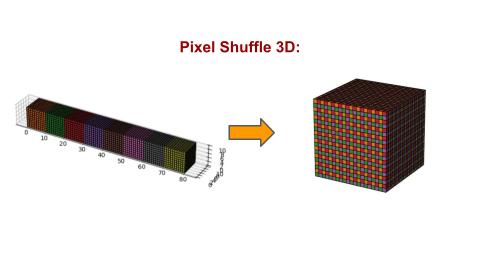
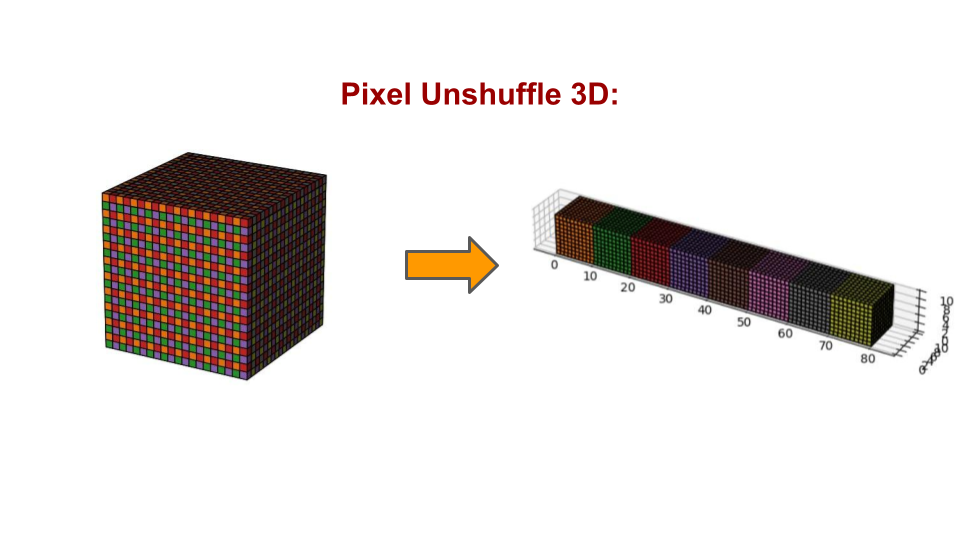

<!-- GETTING STARTED -->
## Getting Started

This repo contains 3D version of original Pixel Shuffle idea from: [Real-Time Single Image and Video Super-Resolution Using an Efficient Sub-Pixel Convolutional Neural Network](https://arxiv.org/abs/1609.05158v2), implemented in [PyTorch](https://pytorch.org/docs/stable/generated/torch.nn.PixelUnshuffle.html).

### Demonstration

Visual intuition of how 3D (un)-shuffle operator works

<figure>
  
</figure>

<figure>
  
</figure>

### Installation

1. Clone the repo
   ```sh
   git clone git@github.com:scalyvladimir/pixel_shuffle3d.git
   ```
   
2. Install all the demanded packages with:
   ```sh
   pip3 install torch numpy
   ```

### Usage
1. ``PixelUnshuffle3d``
   ```python
   from pixel_shuffle3d import PixelUnshuffle3d
   import torch

   pixel_unshuffle = PixelUnshuffle3d(3)
   input = torch.randn(1, 1, 12, 12, 12)
   output = pixel_unshuffle(input)
   print(output.size())
   # torch.Size([1, 27, 4, 4, 4])
   ```

2. ``PixelShuffle3d``
   ```python
   from pixel_shuffle3d import PixelShuffle3d
   import torch

   pixel_shuffle = PixelShuffle3d(3)
   input = torch.randn(1, 27, 4, 4, 4)
   output = pixel_shuffle(input)
   print(output.size())
   # torch.Size([1, 1, 12, 12, 12])
   ```


<!-- CONTRIBUTING -->
## Contributing

Contributions are what make the open source community such an amazing place to learn, inspire, and create. Any contributions you make are **greatly appreciated**.

If you have a suggestion that would make this better, please fork the repo and create a pull request. You can also simply open an issue with the tag "enhancement".
Don't forget to give the project a star! Thanks again!

1. Fork the Project
2. Create your Feature Branch (`git checkout -b feature/AmazingFeature`)
3. Commit your Changes (`git commit -m 'Add some AmazingFeature'`)
4. Push to the Branch (`git push origin feature/AmazingFeature`)
5. Open a Pull Request